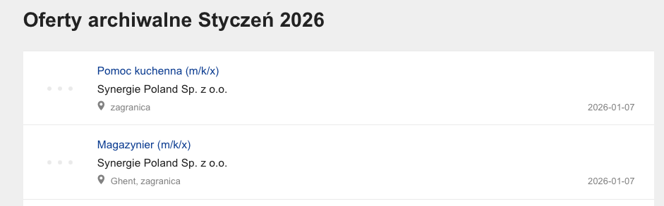
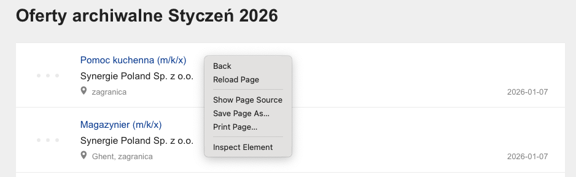
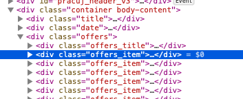
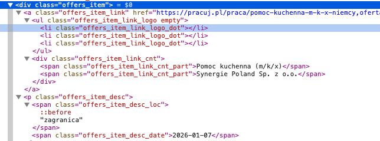
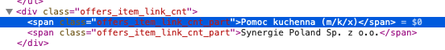

# Pakiety

instalacja potrzebnych pakietów

```{r, eval = FALSE}
install.packages(
                  c("rvest",     ## do web-scrapingu
                   "xml2",       ## przetwarzanie XML
                   "jsonlite",   ## wczytywanie plików w formacie JSON
                   "stringi")    ## przetwarzanie napisow
                 )
```

Ładowanie pakietów

```{r}
library(rvest)
library(stringi)
library(xml2)
library(jsonlite)
```

## Archiwum pracuj.pl

Pobranie samej strony (zawartości)










Pobieranie źrodła strony

```{r}
strona <- read_html("https://archiwum.pracuj.pl/archive/offers?Year=2026&Month=1&PageNumber=1")
strona
```

Pobieramy oferty

```{r}
strona |>
  html_nodes("div.offers_item")
```

Pobranie konkretnego elementu oferty



```{r}
strona |>
  html_nodes("div.offers_item") |>
  html_nodes("span.offers_item_link_cnt_part") |>
  html_text() |>
  head(10)
```

## Zadanie (na rozgrzewkę)

1.  Proszę wejść na stronę: https://nabory.kprm.gov.pl
2.  Proszę nacisnąć "szukaj" aby uzyskać dostęp do wszystkich ofert
    pracy.
3.  Proszę zbadać strukturę strony
4.  Proszę napisać program, który pobierze następujące informacje z
    wyświetlonych ogłoszeń:
    -   link do ogłoszenia
    -   numer ogłoszenia
    -   datę umieszczenia ogłoszenia
    -   miejsce pracy ("Urząd")
5.  Wynik proszę zapisać do ramki danych

## Bardziej zaawansowane przykłady

1.  Pobieranie danych z zawartych w formacie `xml`
2.  Pobieranie danych z zawartych w formacie `json`
3.  "Dobieranie się" do ukrytych API (Zbadaj -\> Network/Sieć)
4.  `read_html` vs `read_html_live` (przykład: Emperor (NOR)
    `https://www.metal-archives.com/bands/emperor/30`)
